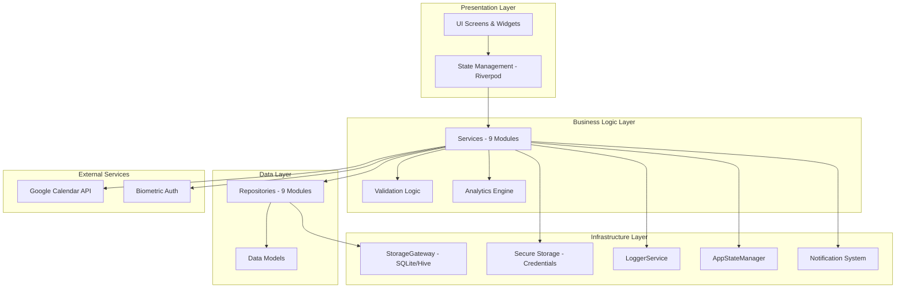

# Design Document - Abdalsalam Personal Life Management App

## Overview

This document provides the comprehensive technical design for the Abdalsalam personal life management application. The app is a unified, offline-first platform for tracking and managing all aspects of daily life across 9 core modules: Religious, Financial, Habits, Sports, Health, Notes, Calendar, Security Vault, and Dashboard/Analytics.

### Design Goals

1. **Data-First Architecture**: All features support comprehensive logging, export with metadata, and future AI integration
2. **Offline-First**: Full functionality without internet connection using local storage
3. **Modular Design**: Self-contained feature modules with clear interfaces
4. **Security by Design**: Encrypted storage for sensitive data, biometric authentication
5. **Baseline Compliance**: All implementations follow BaseModel, BaseRepository, BaseService patterns
6. **State-Aware**: Smart resource management based on battery, connectivity, and storage
7. **Future-Ready**: Designed for server sync and AI agent integration

### Technology Stack

- **Framework**: Flutter (Dart 3.11.1+)
- **Core Package**: abdalsalam_logic_flutter (StorageGateway, AppStateManager, LoggerService, ApiClient)
- **State Management**: Riverpod for UI state
- **Local Storage**: StorageGateway (SQLite + Hive + SharedPreferences)
- **Secure Storage**: flutter_secure_storage for password vault
- **Notifications**: flutter_local_notifications + FCM (from abdalsalam_logic_flutter)
- **Authentication**: local_auth for biometric
- **Charts**: fl_chart for data visualization
- **Calendar**: device_calendar + googleapis for Google Calendar sync

## Architecture

### High-Level System Architecture




### Layer Responsibilities

#### 1. Presentation Layer
- **Screens**: Full-page views for each module
- **Widgets**: Reusable UI components (cards, lists, forms, charts)
- **State Management**: UI state using Riverpod providers
- **Navigation**: Bottom navigation + module-specific routing
- **Theme**: Material Design with light/dark mode support

#### 2. Business Logic Layer
- **Services**: Business logic for each module (29 required methods per BaseService)
- **Validation**: Input validation and business rules enforcement
- **Analytics**: Cross-module insights and statistics calculation
- **Export/Import**: Data serialization with metadata and checksums

#### 3. Data Layer
- **Repositories**: Data access abstraction (24 required methods per BaseRepository)
- **Models**: Data entities extending BaseModel (id, createdAt, updatedAt, deletedAt)
- **Queries**: Optimized database queries with indexes

#### 4. Infrastructure Layer
- **StorageGateway**: Unified storage interface (SQLite for structured data, Hive for key-value, SharedPreferences for settings)
- **Secure Storage**: Encrypted storage for passwords and sensitive data
- **Logger**: Centralized logging with service name prefixes
- **AppStateManager**: Device state monitoring (battery, connectivity, storage)
- **Notifications**: Local and push notifications with module-specific channels

### Module Organization


```
lib/
├── main.dart                          # App entry point
├── app.dart                           # Root app widget
├── core/                              # Core functionality
│   ├── constants/                     # App-wide constants
│   │   ├── app_constants.dart         # General constants
│   │   ├── module_colors.dart         # Module-specific colors
│   │   └── notification_channels.dart # Notification channel IDs
│   ├── theme/                         # Theme configuration
│   │   ├── app_theme.dart             # Light/dark themes
│   │   ├── text_styles.dart           # Typography
│   │   └── colors.dart                # Color palette
│   ├── router/                        # Navigation
│   │   ├── app_router.dart            # Route definitions
│   │   └── route_guards.dart          # Auth guards
│   ├── errors/                        # Error types
│   │   └── app_errors.dart            # AppError hierarchy
│   └── types/                         # Common types
│       └── result.dart                # Result<T, Error> type
├── data/                              # Data layer
│   ├── models/                        # Data models
│   │   ├── base_model.dart            # BaseModel abstract class
│   │   ├── religious/                 # Religious models
│   │   │   ├── prayer_log.dart
│   │   │   ├── quran_reading.dart
│   │   │   └── spiritual_progress.dart
│   │   ├── financial/                 # Financial models
│   │   │   ├── transaction.dart
│   │   │   ├── category.dart
│   │   │   └── budget.dart
│   │   ├── habits/                    # Habits models
│   │   │   ├── habit.dart
│   │   │   ├── habit_log.dart
│   │   │   └── daily_event.dart
│   │   ├── sports/                    # Sports models
│   │   │   ├── workout.dart
│   │   │   ├── exercise.dart
│   │   │   └── workout_schedule.dart
│   │   ├── health/                    # Health models
│   │   │   ├── medication.dart
│   │   │   ├── medication_log.dart
│   │   │   ├── blood_test.dart
│   │   │   └── health_metric.dart
│   │   ├── notes/                     # Notes models
│   │   │   ├── note.dart
│   │   │   ├── todo.dart
│   │   │   └── note_category.dart
│   │   ├── calendar/                  # Calendar models
│   │   │   ├── event.dart
│   │   │   └── reminder.dart
│   │   └── security/                  # Security models
│   │       ├── credential.dart
│   │       └── credential_category.dart
│   └── repositories/                  # Data access layer
│       ├── base_repository.dart       # BaseRepository interface
│       ├── base_repository_impl.dart  # BaseRepository implementation
│       └── [module]_repository.dart   # Module-specific repositories
├── features/                          # Feature modules
│   ├── religious/                     # Religious tracking
│   │   ├── screens/
│   │   │   ├── religious_home_screen.dart
│   │   │   ├── prayer_log_screen.dart
│   │   │   ├── quran_reading_screen.dart
│   │   │   └── spiritual_progress_screen.dart
│   │   ├── widgets/
│   │   │   ├── prayer_time_card.dart
│   │   │   ├── prayer_streak_widget.dart
│   │   │   └── quran_progress_chart.dart
│   │   └── services/
│   │       └── religious_service.dart
│   ├── financial/                     # Financial management
│   ├── habits/                        # Habits & daily events
│   ├── sports/                        # Sports & fitness
│   ├── health/                        # Health management
│   ├── notes/                         # Notes & tasks
│   ├── calendar/                      # Calendar integration
│   ├── security/                      # Security vault
│   └── dashboard/                     # Dashboard & analytics
├── shared/                            # Shared across features
│   ├── widgets/                       # Reusable UI components
│   │   ├── module_card.dart           # Dashboard module card
│   │   ├── stat_card.dart             # Statistics card
│   │   ├── chart_widgets.dart         # Chart components
│   │   ├── empty_state.dart           # Empty state widget
│   │   └── loading_skeleton.dart      # Loading skeleton
│   ├── services/                      # Shared services
│   │   ├── base_service.dart          # BaseService interface
│   │   ├── base_service_impl.dart     # BaseService implementation
│   │   ├── export_service.dart        # Export/import functionality
│   │   ├── notification_service.dart  # Notification management
│   │   └── analytics_engine.dart      # Analytics calculations
│   └── extensions/                    # Dart extensions
│       ├── date_time_extensions.dart
│       ├── string_extensions.dart
│       └── list_extensions.dart
└── providers/                         # Riverpod providers
    ├── app_providers.dart             # Core app providers
    └── [module]_providers.dart        # Module-specific providers
```

## Components and Interfaces

### Base Classes Implementation


#### BaseModel

All data models extend this abstract class:

```dart
abstract class BaseModel extends Equatable {
  final String id;
  final DateTime createdAt;
  final DateTime updatedAt;
  final DateTime? deletedAt;
  
  const BaseModel({
    required this.id,
    required this.createdAt,
    required this.updatedAt,
    this.deletedAt,
  });
  
  Map<String, dynamic> toJson();
  
  bool get isDeleted => deletedAt != null;
  bool get isActive => deletedAt == null;
  
  @override
  List<Object?> get props => [id];
}
```

#### BaseRepository Interface

All repositories implement this interface (24 required methods):

```dart
abstract class BaseRepository<T extends BaseModel> {
  // CRUD Operations (9 methods)
  Future<Result<T, Error>> create(T entity);
  Future<Result<T?, Error>> getById(String id);
  Future<Result<List<T>, Error>> getAll();
  Future<Result<List<T>, Error>> getActive();
  Future<Result<List<T>, Error>> getDeleted();
  Future<Result<void, Error>> update(T entity);
  Future<Result<void, Error>> delete(String id);
  Future<Result<void, Error>> softDelete(String id);
  Future<Result<void, Error>> restore(String id);
  
  // Bulk Operations (3 methods)
  Future<Result<List<T>, Error>> createBulk(List<T> entities);
  Future<Result<void, Error>> updateBulk(List<T> entities);
  Future<Result<void, Error>> deleteBulk(List<String> ids);
  
  // Query Operations (4 methods)
  Future<Result<List<T>, Error>> getByDateRange(DateTime start, DateTime end);
  Future<Result<List<T>, Error>> getByUserId(String userId);
  Future<Result<List<T>, Error>> query(Map<String, dynamic> filters);
  Future<Result<List<T>, Error>> search(String searchTerm);
  
  // Count Operations (3 methods)
  Future<Result<int, Error>> count();
  Future<Result<int, Error>> countActive();
  Future<Result<int, Error>> countDeleted();
  
  // Utility Operations (2 methods)
  Future<Result<void, Error>> deleteAll();
  Future<Result<void, Error>> vacuum();
}
```

#### BaseService Interface

All services implement this interface (29 required methods):

```dart
abstract class BaseService<T extends BaseModel> {
  String get serviceName;
  String get version;
  
  // CRUD Operations (8 methods)
  Future<Result<T, Error>> create(T entity);
  Future<Result<T?, Error>> getById(String id);
  Future<Result<List<T>, Error>> getAll();
  Future<Result<List<T>, Error>> getActive();
  Future<Result<List<T>, Error>> getByDateRange(DateTime start, DateTime end);
  Future<Result<void, Error>> update(T entity);
  Future<Result<void, Error>> delete(String id);
  Future<Result<void, Error>> softDelete(String id);
  
  // Bulk Operations (3 methods)
  Future<Result<List<T>, Error>> createBulk(List<T> entities);
  Future<Result<void, Error>> updateBulk(List<T> entities);
  Future<Result<void, Error>> deleteBulk(List<String> ids);
  
  // Search & Filter (2 methods)
  Future<Result<List<T>, Error>> search(String query);
  Future<Result<List<T>, Error>> filter(Map<String, dynamic> filters);
  
  // Export & Import (4 methods)
  Future<Result<String, Error>> exportToJson();
  Future<Result<Map<String, dynamic>, Error>> exportWithMetadata();
  Future<Result<void, Error>> importFromJson(String json);
  Future<Result<void, Error>> importWithValidation(Map<String, dynamic> data);
  
  // Statistics & Analytics (4 methods)
  Future<Result<int, Error>> count();
  Future<Result<Map<String, dynamic>, Error>> getStatistics();
  Future<Result<Map<String, dynamic>, Error>> getMetadata();
  Future<Result<List<T>, Error>> getRecent(int limit);
  
  // Validation (2 methods)
  Result<void, Error> validate(T entity);
  Result<void, Error> validateBulk(List<T> entities);
  
  // Backup & Restore (2 methods)
  Future<Result<String, Error>> backup();
  Future<Result<void, Error>> restore(String backupData);
}
```

#### Result Type

```dart
abstract class Result<T, E> {
  const Result();
  bool get isSuccess;
  bool get isFailure;
  T? get data;
  E? get error;
}

class Success<T, E> extends Result<T, E> {
  final T _data;
  const Success(this._data);
  @override
  bool get isSuccess => true;
  @override
  bool get isFailure => false;
  @override
  T get data => _data;
  @override
  E? get error => null;
}

class Failure<T, E> extends Result<T, E> {
  final E _error;
  const Failure(this._error);
  @override
  bool get isSuccess => false;
  @override
  bool get isFailure => true;
  @override
  T? get data => null;
  @override
  E get error => _error;
}
```

#### AppError Hierarchy

```dart
abstract class AppError {
  final String message;
  final String? code;
  final dynamic originalError;
  const AppError(this.message, {this.code, this.originalError});
}

class DatabaseError extends AppError {
  const DatabaseError(String message, {String? code, dynamic originalError})
      : super(message, code: code, originalError: originalError);
}

class ValidationError extends AppError {
  const ValidationError(String message, {String? code})
      : super(message, code: code);
}

class ServiceError extends AppError {
  const ServiceError(String message, {String? code, dynamic originalError})
      : super(message, code: code, originalError: originalError);
}

class NotFoundError extends AppError {
  const NotFoundError(String message) : super(message, code: 'NOT_FOUND');
}

class ExportError extends AppError {
  const ExportError(String message) : super(message, code: 'EXPORT_ERROR');
}

class ImportError extends AppError {
  const ImportError(String message) : super(message, code: 'IMPORT_ERROR');
}

class NetworkError extends AppError {
  const NetworkError(String message) : super(message, code: 'NETWORK_ERROR');
}

class AuthError extends AppError {
  const AuthError(String message) : super(message, code: 'AUTH_ERROR');
}
```

## Data Models


### Religious Module Models

#### PrayerLog

```dart
enum PrayerType { fajr, dhuhr, asr, maghrib, isha }

class PrayerLog extends BaseModel {
  final String userId;
  final PrayerType prayerType;
  final DateTime performedAt;
  final bool onTime;
  final bool inCongregation;
  final String? location;
  final String? notes;
  
  const PrayerLog({
    required String id,
    required this.userId,
    required this.prayerType,
    required this.performedAt,
    required this.onTime,
    this.inCongregation = false,
    this.location,
    this.notes,
    required DateTime createdAt,
    required DateTime updatedAt,
    DateTime? deletedAt,
  }) : super(id: id, createdAt: createdAt, updatedAt: updatedAt, deletedAt: deletedAt);
  
  @override
  Map<String, dynamic> toJson() => {
    'id': id,
    'userId': userId,
    'prayerType': prayerType.name,
    'performedAt': performedAt.toIso8601String(),
    'onTime': onTime,
    'inCongregation': inCongregation,
    'location': location,
    'notes': notes,
    'createdAt': createdAt.toIso8601String(),
    'updatedAt': updatedAt.toIso8601String(),
    'deletedAt': deletedAt?.toIso8601String(),
  };
  
  factory PrayerLog.fromJson(Map<String, dynamic> json) => PrayerLog(
    id: json['id'],
    userId: json['userId'],
    prayerType: PrayerType.values.byName(json['prayerType']),
    performedAt: DateTime.parse(json['performedAt']),
    onTime: json['onTime'],
    inCongregation: json['inCongregation'] ?? false,
    location: json['location'],
    notes: json['notes'],
    createdAt: DateTime.parse(json['createdAt']),
    updatedAt: DateTime.parse(json['updatedAt']),
    deletedAt: json['deletedAt'] != null ? DateTime.parse(json['deletedAt']) : null,
  );
}
```


#### QuranReading

```dart
class QuranReading extends BaseModel {
  final String userId;
  final int surahNumber;
  final int ayahFrom;
  final int ayahTo;
  final DateTime readAt;
  final Duration duration;
  final bool memorized;
  final String? notes;
  
  const QuranReading({
    required String id,
    required this.userId,
    required this.surahNumber,
    required this.ayahFrom,
    required this.ayahTo,
    required this.readAt,
    required this.duration,
    this.memorized = false,
    this.notes,
    required DateTime createdAt,
    required DateTime updatedAt,
    DateTime? deletedAt,
  }) : super(id: id, createdAt: createdAt, updatedAt: updatedAt, deletedAt: deletedAt);
  
  @override
  Map<String, dynamic> toJson() => {
    'id': id,
    'userId': userId,
    'surahNumber': surahNumber,
    'ayahFrom': ayahFrom,
    'ayahTo': ayahTo,
    'readAt': readAt.toIso8601String(),
    'duration': duration.inSeconds,
    'memorized': memorized,
    'notes': notes,
    'createdAt': createdAt.toIso8601String(),
    'updatedAt': updatedAt.toIso8601String(),
    'deletedAt': deletedAt?.toIso8601String(),
  };
}
```

#### SpiritualProgress

```dart
class SpiritualProgress extends BaseModel {
  final String userId;
  final DateTime date;
  final List<String> goodDeeds;
  final List<String> badDeeds;
  final String reflectionNotes;
  final String mood;
  final int overallRating;
  
  const SpiritualProgress({
    required String id,
    required this.userId,
    required this.date,
    required this.goodDeeds,
    required this.badDeeds,
    required this.reflectionNotes,
    required this.mood,
    required this.overallRating,
    required DateTime createdAt,
    required DateTime updatedAt,
    DateTime? deletedAt,
  }) : super(id: id, createdAt: createdAt, updatedAt: updatedAt, deletedAt: deletedAt);
}
```


### Financial Module Models

#### Transaction

```dart
enum TransactionType { income, expense }

class Transaction extends BaseModel {
  final String userId;
  final TransactionType type;
  final double amount;
  final String currency;
  final String categoryId;
  final String? subcategoryId;
  final DateTime date;
  final String description;
  final List<String> tags;
  final String paymentMethod;
  final bool recurring;
  
  const Transaction({
    required String id,
    required this.userId,
    required this.type,
    required this.amount,
    required this.currency,
    required this.categoryId,
    this.subcategoryId,
    required this.date,
    required this.description,
    required this.tags,
    required this.paymentMethod,
    this.recurring = false,
    required DateTime createdAt,
    required DateTime updatedAt,
    DateTime? deletedAt,
  }) : super(id: id, createdAt: createdAt, updatedAt: updatedAt, deletedAt: deletedAt);
}
```

#### Category

```dart
class Category extends BaseModel {
  final String userId;
  final String name;
  final TransactionType type;
  final String icon;
  final String color;
  final String? parentCategoryId;
  
  const Category({
    required String id,
    required this.userId,
    required this.name,
    required this.type,
    required this.icon,
    required this.color,
    this.parentCategoryId,
    required DateTime createdAt,
    required DateTime updatedAt,
    DateTime? deletedAt,
  }) : super(id: id, createdAt: createdAt, updatedAt: updatedAt, deletedAt: deletedAt);
}
```


#### Budget

```dart
enum BudgetPeriod { weekly, monthly, yearly }

class Budget extends BaseModel {
  final String userId;
  final String categoryId;
  final double amount;
  final BudgetPeriod period;
  final DateTime startDate;
  final DateTime endDate;
  final double alertThreshold;
  
  const Budget({
    required String id,
    required this.userId,
    required this.categoryId,
    required this.amount,
    required this.period,
    required this.startDate,
    required this.endDate,
    required this.alertThreshold,
    required DateTime createdAt,
    required DateTime updatedAt,
    DateTime? deletedAt,
  }) : super(id: id, createdAt: createdAt, updatedAt: updatedAt, deletedAt: deletedAt);
}
```

### Habits Module Models

#### Habit

```dart
enum HabitFrequency { daily, weekly, custom }

class Habit extends BaseModel {
  final String userId;
  final String name;
  final String description;
  final HabitFrequency frequency;
  final int targetCount;
  final DateTime? reminderTime;
  final String icon;
  final String color;
  final String category;
  
  const Habit({
    required String id,
    required this.userId,
    required this.name,
    required this.description,
    required this.frequency,
    required this.targetCount,
    this.reminderTime,
    required this.icon,
    required this.color,
    required this.category,
    required DateTime createdAt,
    required DateTime updatedAt,
    DateTime? deletedAt,
  }) : super(id: id, createdAt: createdAt, updatedAt: updatedAt, deletedAt: deletedAt);
}
```


#### HabitLog

```dart
class HabitLog extends BaseModel {
  final String habitId;
  final DateTime completedAt;
  final double? value;
  final String? notes;
  final String? mood;
  final bool skipped;
  final String? skipReason;
}
```

#### DailyEvent

```dart
class DailyEvent extends BaseModel {
  final String userId;
  final String eventType;
  final String title;
  final String description;
  final DateTime occurredAt;
  final Duration duration;
  final List<String> tags;
  final String? mood;
  final List<String> relatedHabits;
  final List<String> attachments;
}
```

### Sports Module Models

#### Workout

```dart
class Workout extends BaseModel {
  final String userId;
  final String type;
  final String name;
  final String description;
  final DateTime startTime;
  final DateTime endTime;
  final Duration duration;
  final int caloriesBurned;
  final String intensity;
  final String? location;
}
```

#### Exercise

```dart
class Exercise extends BaseModel {
  final String workoutId;
  final String exerciseName;
  final int sets;
  final int reps;
  final double? weight;
  final double? distance;
  final Duration? duration;
  final String? notes;
}
```


### Health Module Models

#### Medication

```dart
class Medication extends BaseModel {
  final String userId;
  final String name;
  final String dosage;
  final String frequency;
  final DateTime startDate;
  final DateTime? endDate;
  final List<DateTime> reminderTimes;
  final String? prescribedBy;
  final String? notes;
  final DateTime? refillDate;
}
```

#### MedicationLog

```dart
class MedicationLog extends BaseModel {
  final String medicationId;
  final DateTime takenAt;
  final bool skipped;
  final String? skipReason;
  final String? sideEffects;
  final String? notes;
}
```

#### BloodTest

```dart
class BloodTest extends BaseModel {
  final String userId;
  final String testType;
  final DateTime scheduledDate;
  final DateTime? completedDate;
  final Map<String, dynamic> results;
  final String? notes;
  final DateTime? nextTestDate;
  final String? facility;
}
```

#### HealthMetric

```dart
enum MetricType { weight, bloodPressure, glucose, heartRate, temperature, oxygen }

class HealthMetric extends BaseModel {
  final String userId;
  final MetricType metricType;
  final double value;
  final String unit;
  final DateTime measuredAt;
  final String? notes;
}
```


### Notes Module Models

#### Note

```dart
class Note extends BaseModel {
  final String userId;
  final String title;
  final String content;
  final List<String> tags;
  final String? categoryId;
  final bool pinned;
  final bool archived;
  final List<String> attachments;
  final String? color;
}
```

#### Todo

```dart
enum TodoPriority { low, medium, high }
enum TodoStatus { pending, done, cancelled }

class Todo extends BaseModel {
  final String userId;
  final String title;
  final String description;
  final DateTime? dueDate;
  final TodoPriority priority;
  final TodoStatus status;
  final String? categoryId;
  final List<String> tags;
  final DateTime? reminderAt;
  final String? parentTodoId;
  final int order;
}
```

#### NoteCategory

```dart
enum CategoryType { note, todo }

class NoteCategory extends BaseModel {
  final String userId;
  final String name;
  final String icon;
  final String color;
  final CategoryType type;
  final String? parentId;
}
```


### Calendar Module Models

#### Event

```dart
class Event extends BaseModel {
  final String userId;
  final String title;
  final String description;
  final DateTime startTime;
  final DateTime endTime;
  final bool allDay;
  final String? location;
  final List<String> attendees;
  final List<int> reminderMinutes;
  final String? googleEventId;
  final String? color;
  final String? category;
}
```

#### Reminder

```dart
enum ReminderType { notification, email }

class Reminder extends BaseModel {
  final String eventId;
  final DateTime reminderTime;
  final ReminderType type;
  final bool sent;
  final DateTime? snoozedUntil;
}
```

### Security Module Models

#### Credential

```dart
enum PasswordStrength { weak, medium, strong }

class Credential extends BaseModel {
  final String userId;
  final String title;
  final String username;
  final String encryptedPassword;
  final String? website;
  final String? notes;
  final String? categoryId;
  final List<String> tags;
  final bool favorite;
  final DateTime lastModified;
  final PasswordStrength strength;
  final DateTime? expiryDate;
}
```

#### CredentialCategory

```dart
class CredentialCategory extends BaseModel {
  final String userId;
  final String name;
  final String icon;
  final String color;
}
```

## Database Schema


### SQLite Tables

All tables follow the same base structure with additional module-specific fields:

```sql
-- Base fields for all tables
id TEXT PRIMARY KEY,
userId TEXT NOT NULL,
createdAt TEXT NOT NULL,
updatedAt TEXT NOT NULL,
deletedAt TEXT,

-- Indexes for all tables
CREATE INDEX idx_[table]_userId ON [table](userId);
CREATE INDEX idx_[table]_createdAt ON [table](createdAt);
CREATE INDEX idx_[table]_deletedAt ON [table](deletedAt);
```

#### Religious Module Tables

```sql
CREATE TABLE prayer_logs (
  id TEXT PRIMARY KEY,
  userId TEXT NOT NULL,
  prayerType TEXT NOT NULL,
  performedAt TEXT NOT NULL,
  onTime INTEGER NOT NULL,
  inCongregation INTEGER NOT NULL DEFAULT 0,
  location TEXT,
  notes TEXT,
  createdAt TEXT NOT NULL,
  updatedAt TEXT NOT NULL,
  deletedAt TEXT,
  FOREIGN KEY (userId) REFERENCES users(id)
);

CREATE INDEX idx_prayer_logs_userId ON prayer_logs(userId);
CREATE INDEX idx_prayer_logs_performedAt ON prayer_logs(performedAt);
CREATE INDEX idx_prayer_logs_prayerType ON prayer_logs(prayerType);

CREATE TABLE quran_readings (
  id TEXT PRIMARY KEY,
  userId TEXT NOT NULL,
  surahNumber INTEGER NOT NULL,
  ayahFrom INTEGER NOT NULL,
  ayahTo INTEGER NOT NULL,
  readAt TEXT NOT NULL,
  duration INTEGER NOT NULL,
  memorized INTEGER NOT NULL DEFAULT 0,
  notes TEXT,
  createdAt TEXT NOT NULL,
  updatedAt TEXT NOT NULL,
  deletedAt TEXT,
  FOREIGN KEY (userId) REFERENCES users(id)
);

CREATE INDEX idx_quran_readings_userId ON quran_readings(userId);
CREATE INDEX idx_quran_readings_readAt ON quran_readings(readAt);
CREATE INDEX idx_quran_readings_surahNumber ON quran_readings(surahNumber);

CREATE TABLE spiritual_progress (
  id TEXT PRIMARY KEY,
  userId TEXT NOT NULL,
  date TEXT NOT NULL,
  goodDeeds TEXT NOT NULL,
  badDeeds TEXT NOT NULL,
  reflectionNotes TEXT NOT NULL,
  mood TEXT NOT NULL,
  overallRating INTEGER NOT NULL,
  createdAt TEXT NOT NULL,
  updatedAt TEXT NOT NULL,
  deletedAt TEXT,
  FOREIGN KEY (userId) REFERENCES users(id)
);

CREATE INDEX idx_spiritual_progress_userId ON spiritual_progress(userId);
CREATE INDEX idx_spiritual_progress_date ON spiritual_progress(date);
```


#### Financial Module Tables

```sql
CREATE TABLE transactions (
  id TEXT PRIMARY KEY,
  userId TEXT NOT NULL,
  type TEXT NOT NULL,
  amount REAL NOT NULL,
  currency TEXT NOT NULL,
  categoryId TEXT NOT NULL,
  subcategoryId TEXT,
  date TEXT NOT NULL,
  description TEXT NOT NULL,
  tags TEXT NOT NULL,
  paymentMethod TEXT NOT NULL,
  recurring INTEGER NOT NULL DEFAULT 0,
  createdAt TEXT NOT NULL,
  updatedAt TEXT NOT NULL,
  deletedAt TEXT,
  FOREIGN KEY (userId) REFERENCES users(id),
  FOREIGN KEY (categoryId) REFERENCES categories(id)
);

CREATE INDEX idx_transactions_userId ON transactions(userId);
CREATE INDEX idx_transactions_date ON transactions(date);
CREATE INDEX idx_transactions_categoryId ON transactions(categoryId);
CREATE INDEX idx_transactions_type ON transactions(type);

CREATE TABLE categories (
  id TEXT PRIMARY KEY,
  userId TEXT NOT NULL,
  name TEXT NOT NULL,
  type TEXT NOT NULL,
  icon TEXT NOT NULL,
  color TEXT NOT NULL,
  parentCategoryId TEXT,
  createdAt TEXT NOT NULL,
  updatedAt TEXT NOT NULL,
  deletedAt TEXT,
  FOREIGN KEY (userId) REFERENCES users(id),
  FOREIGN KEY (parentCategoryId) REFERENCES categories(id)
);

CREATE INDEX idx_categories_userId ON categories(userId);
CREATE INDEX idx_categories_type ON categories(type);

CREATE TABLE budgets (
  id TEXT PRIMARY KEY,
  userId TEXT NOT NULL,
  categoryId TEXT NOT NULL,
  amount REAL NOT NULL,
  period TEXT NOT NULL,
  startDate TEXT NOT NULL,
  endDate TEXT NOT NULL,
  alertThreshold REAL NOT NULL,
  createdAt TEXT NOT NULL,
  updatedAt TEXT NOT NULL,
  deletedAt TEXT,
  FOREIGN KEY (userId) REFERENCES users(id),
  FOREIGN KEY (categoryId) REFERENCES categories(id)
);

CREATE INDEX idx_budgets_userId ON budgets(userId);
CREATE INDEX idx_budgets_categoryId ON budgets(categoryId);
CREATE INDEX idx_budgets_period ON budgets(period);
```


### Additional Tables

Similar table structures exist for:
- **Habits Module**: habits, habit_logs, daily_events
- **Sports Module**: workouts, exercises, workout_schedules
- **Health Module**: medications, medication_logs, blood_tests, health_metrics
- **Notes Module**: notes, todos, note_categories
- **Calendar Module**: events, reminders
- **Security Module**: credentials, credential_categories

All tables follow the same indexing strategy: userId, date fields, status fields, and foreign keys.

## Export/Import System

### Export Format

```json
{
  "metadata": {
    "serviceName": "ReligiousService",
    "version": "1.0.0",
    "exportedAt": "2026-03-25T10:00:00Z",
    "exportedBy": "user_id",
    "recordCount": 150,
    "dateRange": {
      "start": "2026-01-01T00:00:00Z",
      "end": "2026-03-25T23:59:59Z"
    },
    "filters": {},
    "checksum": "sha256_hash_of_data_array"
  },
  "data": [
    {
      "id": "uuid",
      "userId": "user_id",
      "prayerType": "fajr",
      "performedAt": "2026-03-25T05:30:00Z",
      "onTime": true,
      "inCongregation": false,
      "createdAt": "2026-03-25T05:30:00Z",
      "updatedAt": "2026-03-25T05:30:00Z",
      "deletedAt": null
    }
  ],
  "statistics": {
    "total": 150,
    "active": 148,
    "deleted": 2,
    "completionRate": 0.95,
    "currentStreak": 12
  }
}
```

### Unified Export Format (All Modules)

```json
{
  "metadata": {
    "appVersion": "1.0.0",
    "exportedAt": "2026-03-25T10:00:00Z",
    "exportedBy": "user_id",
    "totalRecords": 1500,
    "checksum": "sha256_hash_of_all_data"
  },
  "modules": {
    "religious": { "metadata": {}, "data": [], "statistics": {} },
    "financial": { "metadata": {}, "data": [], "statistics": {} },
    "habits": { "metadata": {}, "data": [], "statistics": {} },
    "sports": { "metadata": {}, "data": [], "statistics": {} },
    "health": { "metadata": {}, "data": [], "statistics": {} },
    "notes": { "metadata": {}, "data": [], "statistics": {} },
    "calendar": { "metadata": {}, "data": [], "statistics": {} },
    "security": { "metadata": {}, "data": [], "statistics": {} }
  }
}
```


### Export Service Implementation

```dart
class ExportService {
  final LoggerService _logger;
  final List<BaseService> _services;
  
  Future<Result<Map<String, dynamic>, Error>> exportAllModules() async {
    try {
      final modules = <String, dynamic>{};
      
      for (final service in _services) {
        final result = await service.exportWithMetadata();
        if (result.isSuccess) {
          modules[service.serviceName] = result.data;
        }
      }
      
      final allData = modules.values
          .expand((m) => m['data'] as List)
          .toList();
      
      final export = {
        'metadata': {
          'appVersion': '1.0.0',
          'exportedAt': DateTime.now().toIso8601String(),
          'totalRecords': allData.length,
          'checksum': _calculateChecksum(allData),
        },
        'modules': modules,
      };
      
      return Success(export);
    } catch (e, st) {
      _logger.error('Export failed', error: e, stackTrace: st);
      return Failure(ExportError(e.toString()));
    }
  }
  
  String _calculateChecksum(List data) {
    final jsonString = jsonEncode(data);
    final bytes = utf8.encode(jsonString);
    final digest = sha256.convert(bytes);
    return digest.toString();
  }
}
```

### Import Validation Pipeline

```dart
class ImportService {
  Future<Result<void, Error>> importWithValidation(
    Map<String, dynamic> data,
  ) async {
    // Step 1: Validate metadata structure
    final metadataValidation = _validateMetadata(data['metadata']);
    if (metadataValidation.isFailure) return metadataValidation;
    
    // Step 2: Validate version compatibility
    final versionValidation = _validateVersion(data['metadata']['appVersion']);
    if (versionValidation.isFailure) return versionValidation;
    
    // Step 3: Verify checksum
    final checksumValidation = _verifyChecksum(data);
    if (checksumValidation.isFailure) return checksumValidation;
    
    // Step 4: Validate each module's data
    final modules = data['modules'] as Map<String, dynamic>;
    for (final entry in modules.entries) {
      final moduleValidation = await _validateModuleData(
        entry.key,
        entry.value,
      );
      if (moduleValidation.isFailure) return moduleValidation;
    }
    
    // Step 5: Import data
    return await _importData(modules);
  }
}
```

## Service Layer


### Service Implementation Example (ReligiousService)

```dart
class ReligiousService extends BaseServiceImpl<PrayerLog> {
  final PrayerRepository _repository;
  final LoggerService _logger;
  final StorageGateway _storage;
  final AppStateManager _appState;
  
  @override
  String get serviceName => 'ReligiousService';
  
  @override
  String get version => '1.0.0';
  
  const ReligiousService({
    required PrayerRepository repository,
    required LoggerService logger,
    required StorageGateway storage,
    required AppStateManager appState,
  }) : _repository = repository,
       _logger = logger,
       _storage = storage,
       _appState = appState,
       super(
         repository: repository,
         logger: logger,
         storage: storage,
         appState: appState,
       );
  
  @override
  Result<void, Error> validate(PrayerLog entity) {
    final errors = <String>[];
    
    if (entity.userId.isEmpty) {
      errors.add('User ID is required');
    }
    
    if (entity.performedAt.isAfter(DateTime.now())) {
      errors.add('Prayer time cannot be in the future');
    }
    
    if (errors.isNotEmpty) {
      return Failure(ValidationError(errors.join(', ')));
    }
    
    return Success(null);
  }
  
  @override
  Future<Result<Map<String, dynamic>, Error>> getStatistics() async {
    try {
      final all = await _repository.getAll();
      if (all.isFailure) return Failure(all.error);
      
      final prayers = all.data!;
      final active = prayers.where((p) => p.isActive).toList();
      
      // Calculate prayer-specific statistics
      final completionRate = _calculateCompletionRate(active);
      final currentStreak = _calculateStreak(active);
      final onTimeRate = active.where((p) => p.onTime).length / active.length;
      
      final stats = {
        'total': prayers.length,
        'active': active.length,
        'deleted': prayers.length - active.length,
        'completionRate': completionRate,
        'currentStreak': currentStreak,
        'onTimeRate': onTimeRate,
        'byPrayerType': _groupByPrayerType(active),
      };
      
      return Success(stats);
    } catch (e, st) {
      _logger.error('[$serviceName] Statistics failed', error: e, stackTrace: st);
      return Failure(ServiceError(e.toString()));
    }
  }
  
  int _calculateStreak(List<PrayerLog> prayers) {
    // Calculate consecutive days with all 5 prayers
    final prayersByDate = <DateTime, List<PrayerLog>>{};
    for (final prayer in prayers) {
      final date = DateTime(
        prayer.performedAt.year,
        prayer.performedAt.month,
        prayer.performedAt.day,
      );
      prayersByDate.putIfAbsent(date, () => []).add(prayer);
    }
    
    int streak = 0;
    DateTime currentDate = DateTime.now();
    
    while (true) {
      final date = DateTime(currentDate.year, currentDate.month, currentDate.day);
      final dayPrayers = prayersByDate[date] ?? [];
      
      if (dayPrayers.length == 5) {
        streak++;
        currentDate = currentDate.subtract(Duration(days: 1));
      } else {
        break;
      }
    }
    
    return streak;
  }
}
```

## Reminder System


### Notification Channels

```dart
class NotificationChannels {
  static const String prayers = 'prayers';
  static const String medications = 'medications';
  static const String habits = 'habits';
  static const String todos = 'todos';
  static const String events = 'events';
  static const String budgets = 'budgets';
  static const String security = 'security';
  
  static final channels = [
    AndroidNotificationChannel(
      prayers,
      'Prayer Reminders',
      description: 'Notifications for prayer times',
      importance: Importance.high,
    ),
    AndroidNotificationChannel(
      medications,
      'Medication Reminders',
      description: 'Notifications for medication times',
      importance: Importance.high,
    ),
    AndroidNotificationChannel(
      habits,
      'Habit Reminders',
      description: 'Notifications for habit check-ins',
      importance: Importance.defaultImportance,
    ),
    // ... other channels
  ];
}
```

### Notification Service

```dart
class NotificationService {
  final FlutterLocalNotificationsPlugin _notifications;
  final LoggerService _logger;
  
  Future<void> initialize() async {
    const androidSettings = AndroidInitializationSettings('@mipmap/ic_launcher');
    const iosSettings = DarwinInitializationSettings();
    
    await _notifications.initialize(
      InitializationSettings(android: androidSettings, iOS: iosSettings),
      onDidReceiveNotificationResponse: _onNotificationTapped,
    );
    
    // Create channels
    for (final channel in NotificationChannels.channels) {
      await _notifications
          .resolvePlatformSpecificImplementation<
              AndroidFlutterLocalNotificationsPlugin>()
          ?.createNotificationChannel(channel);
    }
  }
  
  Future<void> schedulePrayerReminder(
    PrayerType type,
    DateTime prayerTime,
  ) async {
    final reminderTime = prayerTime.subtract(Duration(minutes: 10));
    
    await _notifications.zonedSchedule(
      type.index,
      'Prayer Time Reminder',
      '${type.name} prayer in 10 minutes',
      tz.TZDateTime.from(reminderTime, tz.local),
      NotificationDetails(
        android: AndroidNotificationDetails(
          NotificationChannels.prayers,
          'Prayer Reminders',
          importance: Importance.high,
          priority: Priority.high,
        ),
      ),
      androidScheduleMode: AndroidScheduleMode.exactAllowWhileIdle,
      uiLocalNotificationDateInterpretation:
          UILocalNotificationDateInterpretation.absoluteTime,
    );
  }
  
  void _onNotificationTapped(NotificationResponse response) {
    // Navigate to relevant module based on notification ID/payload
    _logger.info('Notification tapped: ${response.payload}');
  }
}
```

## UI Architecture


### Navigation Structure

```dart
class AppRouter {
  static const String dashboard = '/';
  static const String religious = '/religious';
  static const String financial = '/financial';
  static const String habits = '/habits';
  static const String sports = '/sports';
  static const String health = '/health';
  static const String notes = '/notes';
  static const String calendar = '/calendar';
  static const String security = '/security';
  static const String settings = '/settings';
  
  static Route<dynamic> generateRoute(RouteSettings settings) {
    switch (settings.name) {
      case dashboard:
        return MaterialPageRoute(builder: (_) => DashboardScreen());
      case religious:
        return MaterialPageRoute(builder: (_) => ReligiousHomeScreen());
      // ... other routes
      default:
        return MaterialPageRoute(builder: (_) => NotFoundScreen());
    }
  }
}
```

### Bottom Navigation

```dart
class MainScaffold extends ConsumerWidget {
  @override
  Widget build(BuildContext context, WidgetRef ref) {
    final currentIndex = ref.watch(navigationIndexProvider);
    
    return Scaffold(
      body: IndexedStack(
        index: currentIndex,
        children: [
          DashboardScreen(),
          QuickAddScreen(),
          CalendarScreen(),
          MoreScreen(),
        ],
      ),
      bottomNavigationBar: BottomNavigationBar(
        currentIndex: currentIndex,
        onTap: (index) => ref.read(navigationIndexProvider.notifier).state = index,
        items: [
          BottomNavigationBarItem(
            icon: Icon(Icons.dashboard),
            label: 'Dashboard',
          ),
          BottomNavigationBarItem(
            icon: Icon(Icons.add_circle),
            label: 'Quick Add',
          ),
          BottomNavigationBarItem(
            icon: Icon(Icons.calendar_today),
            label: 'Calendar',
          ),
          BottomNavigationBarItem(
            icon: Icon(Icons.menu),
            label: 'More',
          ),
        ],
      ),
    );
  }
}
```

### Dashboard Screen

```dart
class DashboardScreen extends ConsumerWidget {
  @override
  Widget build(BuildContext context, WidgetRef ref) {
    final appState = ref.watch(appStateProvider);
    
    return Scaffold(
      appBar: AppBar(
        title: Text('Dashboard'),
        actions: [
          if (appState.isOffline)
            Icon(Icons.cloud_off, color: Colors.red),
          if (appState.batteryInfo?.isLowBattery == true)
            Icon(Icons.battery_alert, color: Colors.orange),
        ],
      ),
      body: RefreshIndicator(
        onRefresh: () async {
          await ref.refresh(dashboardDataProvider.future);
        },
        child: CustomScrollView(
          slivers: [
            SliverToBoxAdapter(
              child: TodayAgendaCard(),
            ),
            SliverPadding(
              padding: EdgeInsets.all(16),
              sliver: SliverGrid(
                gridDelegate: SliverGridDelegateWithFixedCrossAxisCount(
                  crossAxisCount: 2,
                  mainAxisSpacing: 16,
                  crossAxisSpacing: 16,
                  childAspectRatio: 1.2,
                ),
                delegate: SliverChildListDelegate([
                  ModuleCard(
                    title: 'Religious',
                    icon: Icons.mosque,
                    color: Colors.purple,
                    stats: ['4/5 prayers', '12 day streak'],
                    onTap: () => context.push('/religious'),
                  ),
                  ModuleCard(
                    title: 'Financial',
                    icon: Icons.account_balance_wallet,
                    color: Colors.green,
                    stats: ['\$1,234 spent', '85% of budget'],
                    onTap: () => context.push('/financial'),
                  ),
                  // ... other module cards
                ]),
              ),
            ),
          ],
        ),
      ),
    );
  }
}
```

## Error Handling


### Error Handling Strategy

```dart
class ErrorHandler {
  static void handle(Error error, {VoidCallback? onRetry}) {
    if (error is ValidationError) {
      _showValidationError(error);
    } else if (error is NetworkError) {
      _showNetworkError(error, onRetry: onRetry);
    } else if (error is DatabaseError) {
      _showDatabaseError(error);
    } else {
      _showGenericError(error);
    }
  }
  
  static void _showValidationError(ValidationError error) {
    Get.snackbar(
      'Validation Error',
      error.message,
      snackPosition: SnackPosition.BOTTOM,
      backgroundColor: Colors.orange,
      colorText: Colors.white,
    );
  }
  
  static void _showNetworkError(NetworkError error, {VoidCallback? onRetry}) {
    Get.snackbar(
      'Network Error',
      'Please check your internet connection',
      snackPosition: SnackPosition.BOTTOM,
      backgroundColor: Colors.red,
      colorText: Colors.white,
      mainButton: onRetry != null
          ? TextButton(
              onPressed: onRetry,
              child: Text('Retry', style: TextStyle(color: Colors.white)),
            )
          : null,
    );
  }
}
```

### Result Pattern Usage in UI

```dart
class PrayerLogScreen extends ConsumerWidget {
  @override
  Widget build(BuildContext context, WidgetRef ref) {
    final prayersAsync = ref.watch(prayersProvider);
    
    return prayersAsync.when(
      data: (result) {
        if (result.isSuccess) {
          final prayers = result.data!;
          return ListView.builder(
            itemCount: prayers.length,
            itemBuilder: (context, index) {
              return PrayerLogTile(prayer: prayers[index]);
            },
          );
        } else {
          return ErrorWidget(
            error: result.error!,
            onRetry: () => ref.refresh(prayersProvider),
          );
        }
      },
      loading: () => LoadingSkeleton(),
      error: (error, stack) => ErrorWidget(
        error: error,
        onRetry: () => ref.refresh(prayersProvider),
      ),
    );
  }
}
```

## Testing Strategy

### Unit Testing

```dart
void main() {
  group('ReligiousService', () {
    late ReligiousService service;
    late MockPrayerRepository mockRepo;
    late MockLogger mockLogger;
    late MockStorageGateway mockStorage;
    late MockAppStateManager mockAppState;
    
    setUp(() {
      mockRepo = MockPrayerRepository();
      mockLogger = MockLogger();
      mockStorage = MockStorageGateway();
      mockAppState = MockAppStateManager();
      
      service = ReligiousService(
        repository: mockRepo,
        logger: mockLogger,
        storage: mockStorage,
        appState: mockAppState,
      );
    });
    
    test('create should validate and save prayer log', () async {
      final prayer = PrayerLog(
        id: 'test-id',
        userId: 'user-id',
        prayerType: PrayerType.fajr,
        performedAt: DateTime.now(),
        onTime: true,
        createdAt: DateTime.now(),
        updatedAt: DateTime.now(),
      );
      
      when(mockRepo.create(prayer))
          .thenAnswer((_) async => Success(prayer));
      
      final result = await service.create(prayer);
      
      expect(result.isSuccess, true);
      expect(result.data, prayer);
      verify(mockRepo.create(prayer)).called(1);
    });
    
    test('validate should fail for future prayer time', () {
      final prayer = PrayerLog(
        id: 'test-id',
        userId: 'user-id',
        prayerType: PrayerType.fajr,
        performedAt: DateTime.now().add(Duration(days: 1)),
        onTime: true,
        createdAt: DateTime.now(),
        updatedAt: DateTime.now(),
      );
      
      final result = service.validate(prayer);
      
      expect(result.isFailure, true);
      expect(result.error, isA<ValidationError>());
    });
  });
}
```

## Correctness Properties


*A property is a characteristic or behavior that should hold true across all valid executions of a system—essentially, a formal statement about what the system should do. Properties serve as the bridge between human-readable specifications and machine-verifiable correctness guarantees.*

### Property 1: Export Structure Completeness

*For any* module's data export, the resulting JSON should contain exactly three top-level keys: metadata, data, and statistics.

**Validates: Requirements 2.1**

### Property 2: Export Checksum Integrity

*For any* exported data, calculating the SHA-256 checksum of the data array should produce a value that matches the checksum in the metadata.

**Validates: Requirements 2.3**

### Property 3: Import Metadata Validation

*For any* import data with missing or malformed metadata, the import operation should fail with a ValidationError before any data is persisted.

**Validates: Requirements 2.6**

### Property 4: Import Checksum Verification

*For any* imported data where the calculated checksum does not match the metadata checksum, the import operation should fail with an ImportError.

**Validates: Requirements 2.7**

### Property 5: Duplicate Detection Strategy

*For any* set of records containing duplicates, applying the duplicate detection strategy (skip/replace/merge) should result in the expected final state based on the chosen strategy.

**Validates: Requirements 2.10**

### Property 6: Prayer Log Field Completeness

*For any* prayer log created, it should contain all required fields: id, userId, prayerType, performedAt, onTime, createdAt, updatedAt.

**Validates: Requirements 3.2**

### Property 7: Prayer Completion Statistics

*For any* set of prayer logs within a date range, the completion rate should equal (total prayers logged / (5 prayers × number of days)) × 100.

**Validates: Requirements 3.6**

### Property 8: Prayer Streak Calculation

*For any* sequence of prayer logs, the streak should equal the number of consecutive days (starting from today going backward) where all 5 prayers were logged.

**Validates: Requirements 3.7**

### Property 9: Transaction Field Completeness

*For any* transaction created, it should contain all required fields: id, userId, type, amount, currency, categoryId, date, description, tags, paymentMethod, createdAt, updatedAt.

**Validates: Requirements 4.1**

### Property 10: Running Balance Calculation

*For any* sequence of transactions, the running balance should equal the sum of all income transactions minus the sum of all expense transactions.

**Validates: Requirements 4.4**

### Property 11: Budget Alert Trigger

*For any* budget with an alert threshold, when the sum of expenses in the budget's category exceeds (budget amount × alert threshold), an alert notification should be triggered.

**Validates: Requirements 4.7**

### Property 12: Habit Log Field Completeness

*For any* habit completion log created, it should contain all required fields: id, habitId, completedAt, createdAt, updatedAt.

**Validates: Requirements 5.2**

### Property 13: Habit Streak Calculation

*For any* sequence of habit completions for a daily habit, the streak should equal the number of consecutive days (starting from today going backward) where the habit was completed.

**Validates: Requirements 5.3**

### Property 14: Workout Field Completeness

*For any* workout created, it should contain all required fields: id, userId, type, name, startTime, endTime, duration, caloriesBurned, intensity, createdAt, updatedAt.

**Validates: Requirements 6.1**

### Property 15: Workout Statistics Calculation

*For any* set of workouts, the total duration should equal the sum of all individual workout durations, and total calories should equal the sum of all caloriesBurned values.

**Validates: Requirements 6.6**

### Property 16: Medication Field Completeness

*For any* medication created, it should contain all required fields: id, userId, name, dosage, frequency, startDate, reminderTimes, createdAt, updatedAt.

**Validates: Requirements 7.1**

### Property 17: Medication Adherence Rate

*For any* set of medication logs for a specific medication, the adherence rate should equal (number of logs where skipped=false / total scheduled doses) × 100.

**Validates: Requirements 7.4**

### Property 18: Note Field Completeness

*For any* note created, it should contain all required fields: id, userId, title, content, tags, createdAt, updatedAt.

**Validates: Requirements 8.1**

### Property 19: Todo Field Completeness

*For any* todo created, it should contain all required fields: id, userId, title, description, priority, status, createdAt, updatedAt.

**Validates: Requirements 8.3**

### Property 20: Event Field Completeness

*For any* event created, it should contain all required fields: id, userId, title, startTime, endTime, allDay, createdAt, updatedAt.

**Validates: Requirements 9.2**

### Property 21: Password Encryption Round Trip

*For any* password string, encrypting it with AES-256 and then decrypting the result should produce the original password string.

**Validates: Requirements 10.5, 21.2**

### Property 22: Password Strength Calculation

*For any* password, the strength score should be calculable based on defined rules: weak (< 8 chars or no complexity), medium (8+ chars with some complexity), strong (12+ chars with full complexity including uppercase, lowercase, numbers, symbols).

**Validates: Requirements 10.7**

### Property 23: Dashboard Statistics Display

*For any* module with active data, the dashboard should display at least one key statistic for that module.

**Validates: Requirements 11.2**

### Property 24: Offline Operation Functionality

*For any* core CRUD operation (create, read, update, delete), it should complete successfully when the device is in offline mode.

**Validates: Requirements 13.2**

### Property 25: Entity Validation Before Persistence

*For any* entity with invalid required fields (empty userId, null required fields), the create or update operation should fail with a ValidationError before attempting to persist to storage.

**Validates: Requirements 15.1**

### Property 26: Date Range Validation

*For any* entity with startDate and endDate fields, if endDate is before startDate, validation should fail with a ValidationError.

**Validates: Requirements 15.4**

### Property 27: Password Strength Validation

*For any* password that does not meet minimum requirements (< 8 characters, or missing mixed case, or missing numbers), validation should fail with a ValidationError.

**Validates: Requirements 15.10**

### Property 28: Note Search Inclusion

*For any* note where the search term appears in either the title or content, that note should be included in the search results.

**Validates: Requirements 16.2**

### Property 29: Module Statistics Accuracy

*For any* module's data, the calculated statistics (counts, rates, averages) should accurately reflect the underlying data according to the module's specific calculation rules.

**Validates: Requirements 17.1**

### Property 30: Full Backup Completeness

*For any* app state with data across multiple modules, a full backup should produce a JSON file containing data from all modules that have active records.

**Validates: Requirements 22.1**

### Property 31: Backup Version Compatibility

*For any* backup file with a version number incompatible with the current app version, the restore operation should fail with an ImportError indicating version incompatibility.

**Validates: Requirements 22.8**

### Property 32: Backup Checksum Verification

*For any* backup file where the calculated checksum does not match the stored checksum in metadata, the restore operation should fail with an ImportError indicating data corruption.

**Validates: Requirements 22.9**


## Testing Strategy

### Dual Testing Approach

The application requires both unit tests and property-based tests for comprehensive coverage:

- **Unit Tests**: Verify specific examples, edge cases, and error conditions
- **Property Tests**: Verify universal properties across all inputs through randomization

Both approaches are complementary and necessary. Unit tests catch concrete bugs in specific scenarios, while property tests verify general correctness across a wide range of inputs.

### Unit Testing Focus

Unit tests should focus on:
- Specific examples that demonstrate correct behavior
- Integration points between components
- Edge cases (empty lists, null values, boundary conditions)
- Error conditions (network failures, validation errors, database errors)
- UI interactions and state changes

### Property-Based Testing Configuration

**Library Selection**: Use `test` package with custom property-based testing utilities, or integrate `fast_check` equivalent for Dart.

**Test Configuration**:
- Minimum 100 iterations per property test (due to randomization)
- Each property test must reference its design document property
- Tag format: `// Feature: complete-app-implementation, Property {number}: {property_text}`

**Example Property Test**:

```dart
void main() {
  group('Export System Properties', () {
    test('Property 1: Export Structure Completeness', () {
      // Feature: complete-app-implementation, Property 1: Export Structure Completeness
      
      for (int i = 0; i < 100; i++) {
        // Generate random module data
        final randomData = generateRandomPrayerLogs(count: random.nextInt(50));
        
        // Export the data
        final exportResult = await service.exportWithMetadata();
        
        // Verify structure
        expect(exportResult.isSuccess, true);
        final export = exportResult.data!;
        expect(export.keys, containsAll(['metadata', 'data', 'statistics']));
        expect(export.keys.length, 3);
      }
    });
    
    test('Property 2: Export Checksum Integrity', () {
      // Feature: complete-app-implementation, Property 2: Export Checksum Integrity
      
      for (int i = 0; i < 100; i++) {
        final randomData = generateRandomPrayerLogs(count: random.nextInt(50));
        
        final exportResult = await service.exportWithMetadata();
        final export = exportResult.data!;
        
        // Calculate checksum of data array
        final dataArray = export['data'] as List;
        final calculatedChecksum = calculateSHA256(dataArray);
        final metadataChecksum = export['metadata']['checksum'];
        
        expect(calculatedChecksum, equals(metadataChecksum));
      }
    });
  });
  
  group('Prayer Streak Properties', () {
    test('Property 8: Prayer Streak Calculation', () {
      // Feature: complete-app-implementation, Property 8: Prayer Streak Calculation
      
      for (int i = 0; i < 100; i++) {
        // Generate random prayer logs with known streak
        final expectedStreak = random.nextInt(30);
        final prayers = generatePrayersWithStreak(expectedStreak);
        
        // Calculate streak
        final calculatedStreak = service.calculateStreak(prayers);
        
        expect(calculatedStreak, equals(expectedStreak));
      }
    });
  });
  
  group('Balance Calculation Properties', () {
    test('Property 10: Running Balance Calculation', () {
      // Feature: complete-app-implementation, Property 10: Running Balance Calculation
      
      for (int i = 0; i < 100; i++) {
        // Generate random transactions
        final transactions = generateRandomTransactions(count: random.nextInt(100));
        
        // Calculate expected balance
        final income = transactions
            .where((t) => t.type == TransactionType.income)
            .fold(0.0, (sum, t) => sum + t.amount);
        final expenses = transactions
            .where((t) => t.type == TransactionType.expense)
            .fold(0.0, (sum, t) => sum + t.amount);
        final expectedBalance = income - expenses;
        
        // Calculate actual balance
        final actualBalance = service.calculateBalance(transactions);
        
        expect(actualBalance, closeTo(expectedBalance, 0.01));
      }
    });
  });
}
```

### Integration Testing

Critical user flows to test:
1. Create prayer log → View in list → Export data → Import data → Verify integrity
2. Add transaction → Check budget alert → View statistics → Export financial data
3. Complete habit → View streak → Check reminder → Export habits data
4. Log workout → Add exercises → View progress charts → Export fitness data
5. Add medication → Log dose → Check adherence → Export health data
6. Create note → Search → Filter by tags → Export notes data
7. Add event → Sync with Google Calendar → Set reminder → Export calendar data
8. Store credential → Biometric auth → Retrieve password → Export vault data

### Widget Testing

Test all major screens and widgets:
- Dashboard screen with module cards
- Module list screens with search and filter
- Form screens with validation
- Chart widgets with data visualization
- Empty states and loading skeletons
- Error states and retry functionality

### Test Coverage Goals

- **Services**: >80% code coverage
- **Repositories**: >80% code coverage
- **Models**: 100% coverage (toJson/fromJson)
- **Validation Logic**: 100% coverage
- **UI Widgets**: >70% coverage
- **Integration Tests**: All critical flows covered


## Module-Specific Designs

### Religious Module

**Screens**:
- Religious Home: Overview with prayer times, today's prayers, Quran progress
- Prayer Log List: Filterable list of all prayer logs
- Prayer Log Form: Quick log with prayer type, time, on-time toggle
- Quran Reading: Surah/Ayah selector, duration tracker, memorization toggle
- Spiritual Progress: Daily journal with good/bad deeds, mood, reflection

**Key Features**:
- Prayer time calculation using location and date
- Automatic prayer reminders 10 minutes before each prayer
- Streak calculation for consecutive days with all 5 prayers
- Quran progress tracking (ayahs read, surahs completed)
- Visual calendar heatmap for prayer completion

**Widgets**:
- `PrayerTimeCard`: Shows next prayer time with countdown
- `PrayerStreakWidget`: Displays current streak with visual indicator
- `QuranProgressChart`: Circular progress for Quran completion
- `PrayerCalendarHeatmap`: Monthly view with completion indicators

### Financial Module

**Screens**:
- Financial Home: Balance, monthly summary, category breakdown
- Transaction List: Filterable list with search
- Transaction Form: Amount, category, date, description, tags
- Budget Management: Create/edit budgets with alerts
- Financial Reports: Charts and insights

**Key Features**:
- Running balance calculation
- Category-based expense tracking
- Budget alerts when threshold exceeded
- Recurring transaction templates
- Monthly/yearly comparison reports

**Widgets**:
- `BalanceCard`: Current balance with trend indicator
- `CategoryPieChart`: Spending breakdown by category
- `MonthlySpendingChart`: Bar chart for monthly comparison
- `BudgetProgressBar`: Visual budget usage indicator

### Habits Module

**Screens**:
- Habits Home: List of active habits with today's status
- Habit Detail: Completion calendar, streak, statistics
- Habit Form: Name, frequency, target, reminder time
- Daily Events: Journal-style list of events
- Mood Tracker: Emoji-based mood logging with trends

**Key Features**:
- Habit streak calculation
- Completion calendar with visual indicators
- Mood tracking and correlation analysis
- Daily event logging with tags
- Pattern analysis and insights

**Widgets**:
- `HabitCard`: Habit with check-in button and streak
- `CompletionCalendar`: Monthly view with completion dots
- `MoodTrendChart`: Line chart showing mood over time
- `StreakBadge`: Visual representation of current streak

### Sports Module

**Screens**:
- Sports Home: Recent workouts, weekly summary
- Workout List: Filterable list with search
- Active Workout: Timer, exercise list, rest timer
- Exercise Library: Searchable list with instructions
- Progress Charts: Weight, reps, frequency trends

**Key Features**:
- Active workout timer with rest intervals
- Exercise library with muscle groups
- Personal record tracking
- Workout templates for quick logging
- Progress visualization

**Widgets**:
- `WorkoutCard`: Summary with duration and calories
- `RestTimer`: Countdown timer between sets
- `ProgressChart`: Line chart for weight/reps over time
- `PRBadge`: Personal record indicator

### Health Module

**Screens**:
- Health Home: Today's medications, upcoming tests
- Medication List: Active medications with schedules
- Medication Form: Name, dosage, frequency, reminders
- Health Metrics: Weight, BP, glucose tracking
- Blood Tests: Schedule and results tracking

**Key Features**:
- Medication reminders at scheduled times
- Adherence rate calculation
- Health metric trends with charts
- Blood test scheduling and results
- Refill reminders

**Widgets**:
- `MedicationScheduleCard`: Today's medication timeline
- `AdherenceRateWidget`: Circular progress indicator
- `HealthMetricChart`: Line chart for metric trends
- `RefillReminderBadge`: Days until refill needed

### Notes Module

**Screens**:
- Notes Home: List with pinned notes at top
- Note Editor: Rich text editor with formatting
- Todo List: Filterable by status, priority, due date
- Categories: Manage note and todo categories
- Search Results: Highlighted matches

**Key Features**:
- Rich text editing (bold, italic, lists, headings)
- Tag-based organization
- Pinned notes
- Todo with subtasks
- Full-text search with highlighting

**Widgets**:
- `NoteCard`: Preview with title, snippet, tags
- `TodoItem`: Checkbox, title, due date, priority indicator
- `RichTextEditor`: Formatting toolbar and editor
- `TagChip`: Clickable tag for filtering

### Calendar Module

**Screens**:
- Calendar View: Month/week/day views
- Event List: Agenda-style list
- Event Form: Title, time, location, attendees, reminders
- Unified Timeline: Events from all modules
- Google Calendar Sync: Settings and status

**Key Features**:
- Multiple view modes (month, week, day)
- Google Calendar synchronization
- Events from all modules in unified view
- Multiple reminders per event
- Color-coded by module/category

**Widgets**:
- `CalendarGrid`: Month view with event indicators
- `EventCard`: Event with time, location, attendees
- `TimelineView`: Vertical timeline for day view
- `SyncStatusIndicator`: Google Calendar sync status

### Security Vault Module

**Screens**:
- Vault Lock: Biometric authentication screen
- Credential List: Masked passwords, search
- Credential Form: Title, username, password, website
- Password Generator: Configurable options
- Categories: Organize credentials

**Key Features**:
- Biometric authentication (fingerprint/face)
- AES-256 password encryption
- Password strength calculation
- Password generator
- Auto-clear clipboard after 30 seconds
- Expiry reminders

**Widgets**:
- `BiometricLockScreen`: Authentication prompt
- `CredentialCard`: Masked password with reveal button
- `PasswordStrengthIndicator`: Visual strength meter
- `PasswordGenerator`: Options and generate button

### Dashboard Module

**Screens**:
- Dashboard: Module cards with key stats
- Today's Agenda: Upcoming prayers, medications, events, todos
- Analytics: Cross-module insights and correlations
- Achievements: Milestones and badges

**Key Features**:
- Overview cards for all 9 modules
- Quick add modal with tabs
- Today's agenda with timeline
- Cross-module analytics
- Achievement badges
- Customizable card order

**Widgets**:
- `ModuleCard`: Icon, title, stats, tap to navigate
- `AgendaTimeline`: Today's scheduled items
- `AchievementBadge`: Milestone indicator
- `QuickAddModal`: Tabbed interface for quick logging
- `InsightCard`: Cross-module correlation insights

## Implementation Notes

### State Management with Riverpod

```dart
// Core providers
final storageGatewayProvider = Provider<StorageGateway>((ref) {
  return StorageGateway.instance;
});

final loggerProvider = Provider<LoggerService>((ref) {
  return LoggerServiceImpl();
});

final appStateProvider = StreamProvider<AppStateInfo>((ref) {
  final appStateManager = ref.watch(appStateManagerProvider);
  return appStateManager.stateStream;
});

// Repository providers
final prayerRepositoryProvider = Provider<PrayerRepository>((ref) {
  return PrayerRepositoryImpl(
    ref.watch(storageGatewayProvider),
    ref.watch(loggerProvider),
  );
});

// Service providers
final religiousServiceProvider = Provider<ReligiousService>((ref) {
  return ReligiousService(
    repository: ref.watch(prayerRepositoryProvider),
    logger: ref.watch(loggerProvider),
    storage: ref.watch(storageGatewayProvider),
    appState: ref.watch(appStateManagerProvider),
  );
});

// Data providers
final prayersProvider = FutureProvider<Result<List<PrayerLog>, Error>>((ref) {
  final service = ref.watch(religiousServiceProvider);
  return service.getAll();
});

final prayerStatsProvider = FutureProvider<Result<Map<String, dynamic>, Error>>((ref) {
  final service = ref.watch(religiousServiceProvider);
  return service.getStatistics();
});
```

### Performance Optimization

1. **List Rendering**: Use `ListView.builder` for all lists
2. **Pagination**: Implement for lists with >100 items
3. **Const Constructors**: Use throughout for stateless widgets
4. **Memory Caching**: Cache frequently accessed data (prayer times, categories)
5. **Database Indexes**: On userId, date fields, status for all tables
6. **Bulk Operations**: Use transactions for multiple inserts/updates
7. **Lazy Loading**: Load charts and images on demand
8. **Debouncing**: Search input debounced to 300ms

### Security Considerations

1. **Password Encryption**: AES-256 with keys stored in flutter_secure_storage
2. **Biometric Auth**: Required for Security Vault access
3. **Auto-Lock**: Vault locks after 5 minutes of inactivity
4. **No Logging**: Sensitive data never logged
5. **Export Warning**: User warned about sensitive data in exports
6. **Input Sanitization**: All user input validated and sanitized
7. **User Isolation**: All data operations scoped to current user

### Offline-First Implementation

1. **Local Storage**: All data in SQLite via StorageGateway
2. **Queue Sync**: Operations queued when offline, executed when online
3. **Connectivity Monitoring**: AppStateManager tracks online/offline state
4. **Cached Prayer Times**: 30 days cached for offline use
5. **Local Calendar**: Works without Google Calendar sync
6. **Offline Export**: Save to device storage without network
7. **Offline Import**: Load from device storage without network

### State-Aware Operations

1. **Battery Monitoring**: Defer non-critical operations when <20%
2. **Connectivity Awareness**: Prompt before large sync on cellular
3. **Storage Monitoring**: Warn when storage low
4. **Auto-Sync**: Only on WiFi unless user overrides
5. **Background Operations**: Respect battery and connectivity state
6. **Logging**: All state-aware decisions logged for debugging

## Deployment Considerations

### Build Configuration

```yaml
# pubspec.yaml version
version: 1.0.0+1

# Android build.gradle
minSdkVersion: 21
targetSdkVersion: 34
compileSdkVersion: 34

# iOS Info.plist
CFBundleShortVersionString: 1.0.0
CFBundleVersion: 1
```

### Required Permissions

**Android (AndroidManifest.xml)**:
```xml
<uses-permission android:name="android.permission.INTERNET" />
<uses-permission android:name="android.permission.USE_BIOMETRIC" />
<uses-permission android:name="android.permission.SCHEDULE_EXACT_ALARM" />
<uses-permission android:name="android.permission.POST_NOTIFICATIONS" />
<uses-permission android:name="android.permission.READ_CALENDAR" />
<uses-permission android:name="android.permission.WRITE_CALENDAR" />
<uses-permission android:name="android.permission.ACCESS_FINE_LOCATION" />
```

**iOS (Info.plist)**:
```xml
<key>NSFaceIDUsageDescription</key>
<string>We need Face ID to secure your password vault</string>
<key>NSCalendarsUsageDescription</key>
<string>We need calendar access to sync events</string>
<key>NSLocationWhenInUseUsageDescription</key>
<string>We need location to calculate prayer times</string>
```

### Migration Strategy

Version 1.0.0 is the initial release. Future migrations will:
1. Include version number in all data models
2. Write migration scripts for schema changes
3. Test migrations with real data
4. Support rollback capability
5. Backup before migration

### Monitoring and Analytics

1. **Error Tracking**: Log all errors with context
2. **Performance Metrics**: Track app startup time, screen load times
3. **Usage Analytics**: Track feature usage (privacy-respecting)
4. **Crash Reporting**: Capture and log crashes
5. **Export Logs**: Allow users to export logs for support

## Conclusion

This design document provides a comprehensive technical blueprint for the Abdalsalam personal life management application. The architecture follows clean architecture principles with clear separation of concerns, offline-first design, and comprehensive data export/import capabilities.

All implementations must comply with the baseline requirements, ensuring consistency across all 9 modules. The property-based testing approach ensures correctness across a wide range of inputs, while unit tests verify specific behaviors and edge cases.

The modular design allows for independent development and testing of each feature module, while the shared infrastructure (base classes, services, storage) ensures consistency and reduces code duplication.

